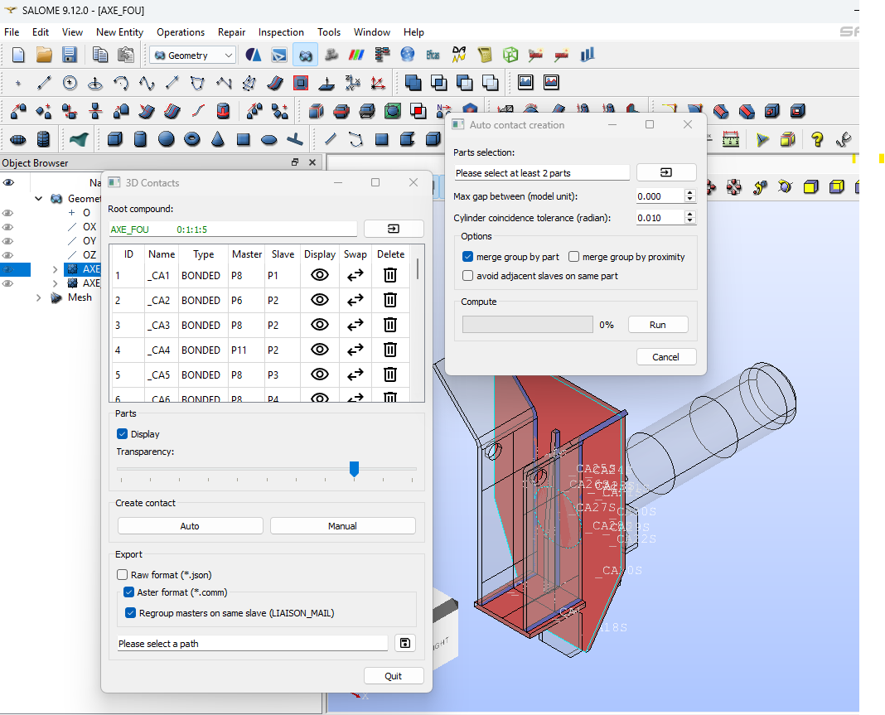
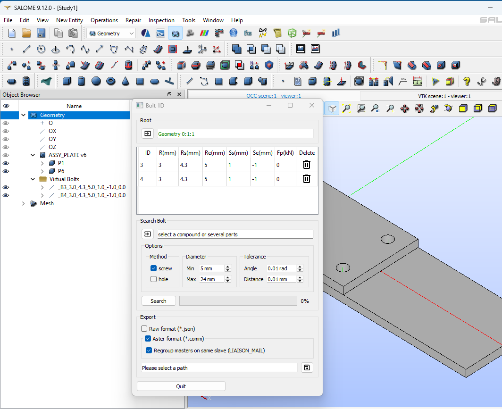

# SalomeUtils

[](https://www.gnu.org/licenses/lgpl-2.1)
[](https://www.python.org/)
[](https://www.salome-platform.org/)

Collection of Python scripts to automate tasks in the Salome platform, particularly oriented towards the preparation of finite element simulations with Code_Aster.

## 📋 Table of Contents

- [Features](#-features)
- [Prerequisites](#-prerequisites)
- [Installation](#-installation)
- [Usage](#-usage)
- [Available Scripts](#-available-scripts)
- [Project Structure](#-project-structure)
- [Contributing](#-contributing)
- [License](#-license)
- [Author](#-author)

## 🚀 Features

### Automatic 3D Contact Generation
- Automatic detection of intersections between parts
- Intuitive graphical interface for configuration
- Direct export to Code_Aster
- Master/slave contact management



### 1D Virtual Bolts
- Automatic recognition of screws, nuts, and holes
- Conversion to 1D elements to optimize calculations
- Automatic calculation of mechanical properties
- Support for different types of fasteners



### Part Management
- Automatic batch renaming
- Creation of geometric groups
- Organization of Salome study tree

## 📋 Prerequisites

- **Salome Platform** 9.0 or higher
- **Python** 3.6+ (included with Salome)
- **PyQt5** (included with Salome)
- **NumPy** (included with Salome)

### Required Python Modules
```python
import salome
from salome.geom import geomBuilder
from PyQt5.QtWidgets import *
from PyQt5.QtCore import *
import numpy as np
```

## 🔧 Installation

### Method 1: Direct Cloning
```bash
git clone https://github.com/marcDuboc/SalomeUtils.git
cd SalomeUtils
```

### Method 2: Download
1. Download the repository as ZIP
2. Extract to your Salome working directory
3. Add the path to Salome's Python scripts

### Configuration in Salome
1. Open Salome
2. Go to **File > Preferences > Python**
3. Add the path to the `scripts/` folder in the PYTHONPATH

## 📖 Usage

### Launching Scripts

#### In the Salome Interface
1. Open the **Geometry** module
2. Go to **File > Load Script**
3. Select the desired script from the `scripts/` folder

#### Command Line
```bash
# From Salome
salome -t python contactAuto.py

# Or directly in the Salome Python console
exec(open('/path/to/SalomeUtils/scripts/contactAuto.py').read())
```

### Typical Workflow

1. **Preparation**: Import your geometry into Salome
2. **Renaming**: Use `renameAuto.py` to organize your parts
3. **Contacts**: Launch `contactAuto.py` to generate contacts
4. **Bolts**: Use `virtualBolt.py` to simplify fasteners
5. **Export**: Export to Code_Aster for simulation

## 📝 Available Scripts

### 🔗 contactAuto.py
**Automatic contact generation between parts**

```python
# Main features
- Detection of geometric intersections
- Configuration of contact parameters (gap, angle)
- Automatic master/slave management
- Code_Aster export (.comm)
```

**Graphical Interface:**
- Selection of compound or multiple parts
- Configurable tolerance parameters
- Preview of detected contacts
- Export in RAW or ASTER format

### 🔩 virtualBolt.py
**Creation of 1D virtual bolts**

```python
# Detection methods
- SCREW: Detection screw + nut + holes
- HOLE: Detection by aligned holes
```

**Features:**
- Automatic recognition of cylindrical shapes
- Calculation of mechanical properties (radius, preload)
- Creation of 1D elements in Salome
- Export of properties for Code_Aster

### 📝 renameAuto.py
**Renaming and organization of parts**

```python
# Available options
- Customizable prefix
- Automatic group creation
- Batch renaming
```

## 🗃️ Project Structure

```
SalomeUtils/
├── README.md
├── scripts/
│   ├── contactAuto.py          # Main contacts script
│   ├── virtualBolt.py          # Main bolts script
│   ├── renameAuto.py          # Renaming script
│   └── common/                # Shared modules
│       ├── __init__.py        # Logging configuration
│       ├── properties.py      # Geometric classes
│       ├── tree.py           # Salome tree navigation
│       ├── contact/          # Contact modules
│       │   ├── data.py       # Contact data management
│       │   ├── intersect.py  # Intersection algorithms
│       │   ├── aster.py      # Code_Aster export
│       │   └── cgui/         # Graphical interface
│       ├── bolt/             # Bolt modules
│       │   ├── data.py       # Bolt data management
│       │   ├── shape.py      # Shape recognition
│       │   ├── aster.py      # Code_Aster export
│       │   └── bgui/         # Graphical interface
│       └── img/              # Graphic resources
└── template/
    ├── base.comm             # Code_Aster template
    └── ref_NL_MPI.txt       # Parallel calculations reference
```

## 🔧 Advanced Configuration

### Contact Parameters
```python
# In contactAuto.py
gap = 0.1          # Maximum gap for detection
angle = 5.0        # Angular tolerance (degrees)
merge_by_part = True      # Merge by part
merge_by_proximity = True # Merge by proximity
```

### Bolt Parameters
```python
# In virtualBolt.py
d_min = 3.0        # Minimum diameter (mm)
d_max = 36.0       # Maximum diameter (mm)
tol_axis = 0.01    # Axis tolerance (mm)
tol_dist = 0.01    # Distance tolerance (mm)
```

## 🛠 Troubleshooting

### Common Issues

**Script won't launch:**
```python
# Check the PYTHONPATH in Salome
import sys
sys.path.append('/path/to/SalomeUtils/scripts')
```

**PyQt5 import error:**
```bash
# Check PyQt5 installation in Salome
python -c "from PyQt5.QtWidgets import QApplication"
```

**Geometric detection problems:**
- Check that parts are valid solids
- Adjust tolerance parameters
- Use debug function in logs

### Debug Logs
Logs are automatically created in `scripts/log/debug.log`

## 🤝 Contributing

Contributions are welcome! To contribute:

1. Fork the project
2. Create a branch for your feature (`git checkout -b feature/AmazingFeature`)
3. Commit your changes (`git commit -m 'Add some AmazingFeature'`)
4. Push to the branch (`git push origin feature/AmazingFeature`)
5. Open a Pull Request

### Code Standards
- Follow PEP 8 for Python style
- Document new functions
- Add tests if possible
- Use descriptive commit messages

## 📄 License

This project is licensed under LGPL v2.1 - see the [LICENSE](LICENSE) file for details.

## 👨‍💻 Author

**Marc DUBOC**
- Email: [marcduboc@hotmail.com](mailto:marc.duboc@example.com)
- GitHub: [@marcDuboc](https://github.com/marcDuboc)

## 🙏 Acknowledgments

- Salome Platform development team
- Code_Aster community
- Project contributors

## 📚 Additional Documentation

- [Salome Documentation](https://docs.salome-platform.org/)
- [Code_Aster Guide](https://www.code-aster.org/spip.php?rubrique2)
- [PyQt5 Documentation](https://doc.qt.io/qtforpython/)

---

**Version:** 08/01/2025  
**Compatibility:** Salome 9.0+, Python 3.6+